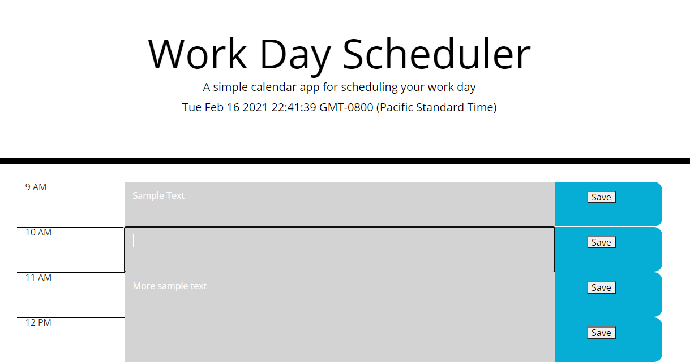

  

# Fan-task-tic
## Tyler Ink Broeker
## Description
A simple application that gives the user the ability to write and save notes for each hour of a day using local storage. The current time, day, month and year are displayed at the top along with the user’s time zone. Each hour is colored green when the current time is before it, red when it is the current hour, and grey when it is passed, the day resets at midnight.

## Table of Contents
  - [User-Story!](#user-story)

  - [Installation!](#installation)

  - [Usage!](#usage)

  - [Questions?](#author)

## User-Story:
There are never enough hours in the day, and even when you have the time, managing in on your own can be troublesome. This simple application seeks to give a digital place for users to write down tasks or reminders for that day on the hour and save it by using local storage.
## Installation:
No installation, simple HTML/CSS/Javascript application
## Usage:
To run this application, either clone repository and run from your machine or simply use what is up on github pages.
## Author:
Feel free to reach out to me with questions!

GitHub: [Tyler Ink Broeker](https://github.com/Tyler Ink Broeker)

